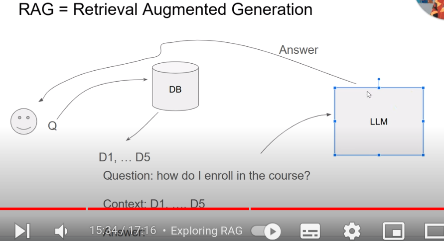

# LLM (Large Language Model)

- Language Models, are models that predict the next word based on the text so far.
- Language Models complete the input.
- Language Models can are simple, such as Naive Bayes.
- Large Language Models have much more parameters, they use a lot of data.
- LLMs are based on transformersñ
- In this course we will treat them as black boxes and not go into the architecture.

# RAG (Retrieval Augmented Generation)

- We use retrieval to augment the Generation
- Retrieval = Search, Generation = LLM
- We want to give the model more information to answer specific questions
  

# RAG architechture

# Course outcome
